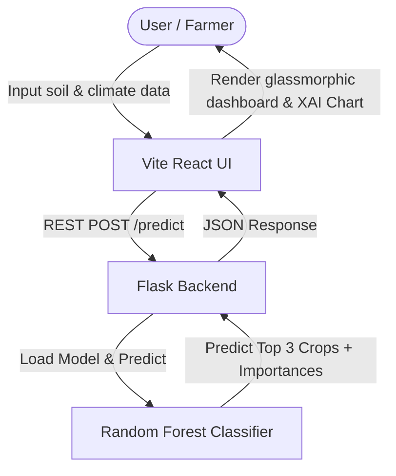

# 🌱 AgriPredict AI: Smart Agriculture AI System

AgriPredict AI is a state-of-the-art **Explainable Machine Learning (XML)** application designed to assist farmers, agricultural scientists, and researchers in identifying the most suitable crop to cultivate based on specific soil macronutrients and environmental factors. 

Featuring a premium glassmorphic dashboard, real-time predictions, and **Explainable AI (XAI)** metrics, AgriPredict AI does not just tell you *what* crop to grow—it shows you *why* using advanced model feature importances.

---

## 📐 Architecture & Workflow



---

## 🛠️ Tech Stack & Dependencies

The project is cleanly decoupled into two main layers: a lightweight, robust machine learning API and an interactive data visualization frontend.

### 📦 Backend (Machine Learning & API)
* **Language**: Python 3.x
* **Framework**: `Flask` & `Flask-CORS` (for REST API delivery)
* **ML Library**: `scikit-learn` (Random Forest Classifier)
* **Data Processing**: `pandas` & `numpy`
* **Serialization**: `pickle` (for model deployment)

### 🎨 Frontend (Dashboard & Visualization)
* **Framework**: React 19 + Vite (Ultra-fast build & HMR)
* **Styling**: Modern CSS with Glassmorphism variables, dark mode aesthetics, and responsive grids
* **Animations**: `framer-motion` (Fluid micro-interactions and transitions)
* **Charts & Plots**: `recharts` (Dynamic, responsive horizontal bar charts for Explainable AI insights)
* **Maps**: `leaflet` & `react-leaflet` (Ready for geographical overlay)
* **Icons**: `lucide-react`

---

## 📁 Directory Structure

```text
AgriPredict_AI/
│
├── backend/
│   ├── models/
│   │   ├── crop_model.pkl          # Trained Random Forest classifier
│   │   └── feature_importance.pkl  # Extracted feature importances
│   ├── app.py                      # Flask REST API server
│   ├── data_fetcher.py             # Open-Meteo & SoilGrids APIs fetcher
│   ├── train_model.py              # ML training & synthetic data generation pipeline
│   └── package-lock.json
│
├── frontend/
│   ├── public/                     # Static icons & favicons
│   ├── src/
│   │   ├── assets/                 # Brand assets
│   │   ├── App.jsx                 # Main Dashboard component
│   │   ├── App.css                 # Custom component-specific styling
│   │   ├── index.css               # Global theme styles & glassmorphic system
│   │   └── main.jsx
│   ├── eslint.config.js
│   ├── package.json                # Frontend dependencies
│   └── vite.config.js
│
├── start_app.ps1                   # Smart launcher script (UTF-8)
└── README.md                       # System documentation
```

---

## 🤖 The Machine Learning Pipeline

### 1. The Dataset
The model learns from a robust agronomic feature set containing 7 independent variables:
* **`N`**: Nitrogen content in soil (mg/kg)
* **`P`**: Phosphorus content in soil (mg/kg)
* **`K`**: Potassium content in soil (mg/kg)
* **`temperature`**: Ambient temperature (°C)
* **`humidity`**: Relative humidity (%)
* **`ph`**: Soil pH value (acidity/alkalinity)
* **`rainfall`**: Average rainfall (mm)

### 2. The Model: Random Forest Classifier
We use a **Random Forest Classifier** with `n_estimators=100` because:
* It naturally handles non-linear relationships between climate variables (e.g., how high temperature combined with high rainfall specifically favors *Rice*).
* It provides built-in, reliable feature importances (`feature_importances_`) to power our **Explainable AI (XAI)** system.
* It is highly robust against overfitting and handles multi-class classification natively.

### 3. Model Training & Evaluation
To retrain the model or update the synthetic data distributions:
```bash
cd backend
python train_model.py
```
* **Output**: This will output the validation accuracy (typically >90% depending on the boundaries) and regenerate both `crop_model.pkl` and `feature_importance.pkl` inside the `models/` directory.

---

## 🔌 API Documentation

### **POST** `/auto-predict`
Automatically gathers soil and climate values based on latitude/longitude, runs prediction, and returns recommendations.

#### **Request Body** (`application/json`)
```json
{
  "latitude": 21.1458,
  "longitude": 79.0882,
  "iot_data": {}
}
```

### **POST** `/predict`
Retrieves a crop recommendation and model transparency insights for a given set of manual soil and environmental parameters.

#### **Request Body** (`application/json`)
```json
{
  "N": 90,
  "P": 42,
  "K": 43,
  "temperature": 20.8,
  "humidity": 82,
  "ph": 6.5,
  "rainfall": 202.5
}
```

---

## 🚀 How to Run the Project

### Prerequisites
Make sure you have the following installed on your system:
* **Python 3.10+** (with `pip`)
* **Node.js 18+** (with `npm`)

### The 1-Step Launcher (Recommended for Windows)
Double-click or run the PowerShell startup script at the root directory:
```powershell
powershell -ExecutionPolicy Bypass -File .\start_app.ps1
```
* This will launch the backend Flask server and frontend Vite server simultaneously in separate windows.

---

### Manual Launch (Step-by-Step)

#### 1. Setup & Run Backend
Navigate to the `backend` folder, install requirements, and run the server:
```bash
cd backend
# Setup virtual environment
python -m venv venv
.\venv\Scripts\activate

# Install required packages
pip install -r requirements.txt

# Run Flask
python app.py
```
The API will be available at **`http://localhost:5000`**.

#### 2. Setup & Run Frontend
Navigate to the `frontend` folder, install Node modules, and launch the dev server:
```bash
cd frontend
npm install
npm run dev
```
The client app will be live at **`http://localhost:5173`**.

---

## 📈 Key UI Features & Capabilities

1. **Auto API Integration**: Automatically fetches real-time temperature, humidity, and annual rainfall (Open-Meteo) plus soil metrics (SoilGrids) based on selected location coordinates.
2. **Interactive Site Picker**: Features browser geolocation detection, direct coordinates inputs, and an interactive draggable Leaflet map marker.
3. **Soil & Climate Modeler**: Input custom metrics via form fields to simulate agricultural environments.
4. **Glassmorphism Theme**: Features high-fidelity design metrics, deep background gradients, and sleek blur effects.
5. **Probability Distributions**: Displays the top 3 recommended crops with confidence percentages.
6. **Explainable AI Visualizer**: Features interactive horizontal bar charts illustrating the specific weighting of soil and environment attributes utilized by the random forest decision boundary.
